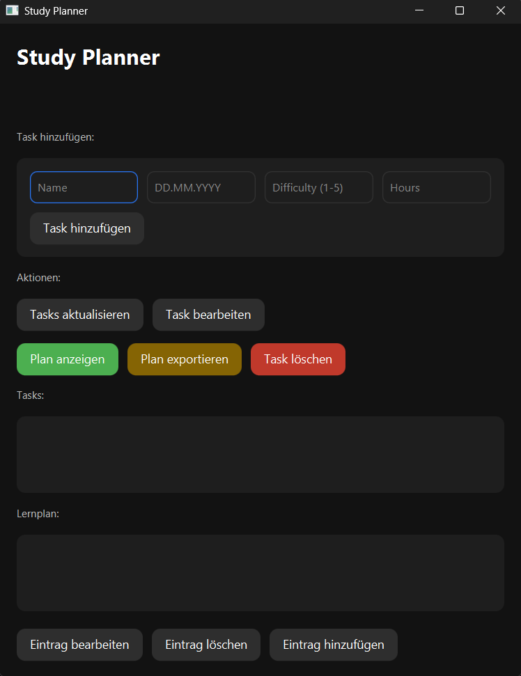
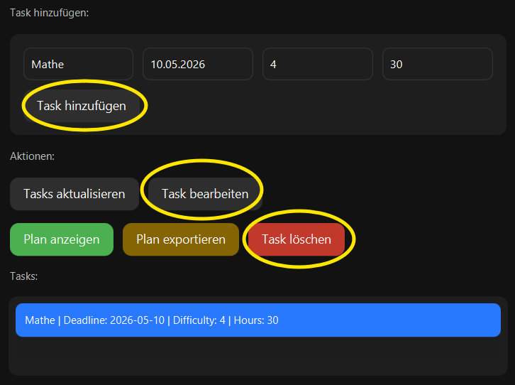
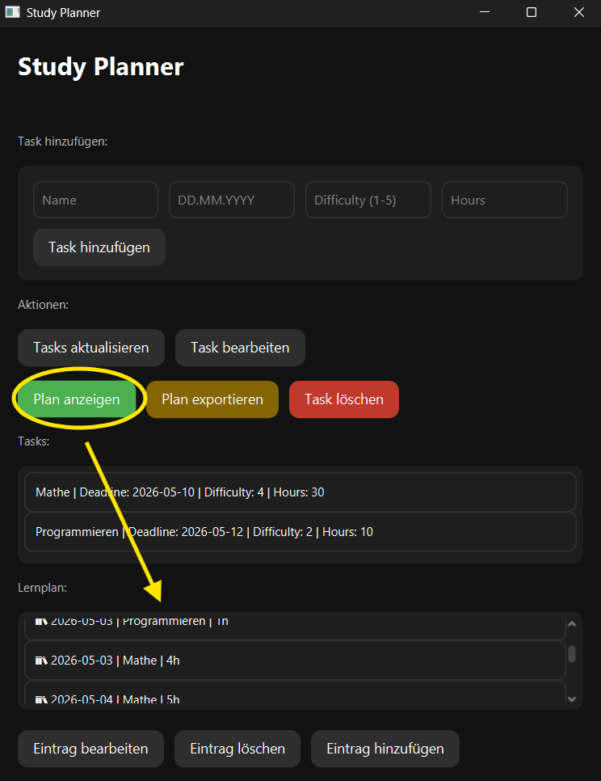

# 📚 Study Planner


> 🧠 Intelligent study planning with automatic schedule generation

A desktop application built with **JavaFX** that helps students efficiently plan their study sessions based on deadlines, workload, and difficulty.

---

## 🚀 Features

- ➕ Create, edit, and delete tasks  
- 📅 Deadline-based scheduling  
- ⚖️ Difficulty weighting (1–5)  
- 🧠 Automatic study plan generation  
- 📊 Daily learning session distribution  
- 📤 Export study plans as CSV  
- 🎨 Modern dark-mode UI  
- ⚠️ Smart handling of expired tasks  
- 🔄 Automatic invalidation of outdated plans  

---

## 📸 Screenshots

### 🏠 Main Interface


### ➕ Task Management


### 📊 Study Plan View


> 📁 Store screenshots in `docs/screenshots/`

---

## 🧱 Project Structure

```bash
study_planner/
│
├── model/
│   ├── Task.java
│   └── StudySession.java
│
├── planner/
│   ├── StudyPlannerAlgorithm.java
│   ├── PlanningService.java
│   └── PlanExporter.java
│
├── storage/
│   ├── StorageManager.java
│   └── data.json
│
├── ui/
│   ├── MainApp.java
│   └── style.css

---

## 📸 Screenshots

- Java17 or higher
- JavaFX SDK (21+ recommended)

---

## ▶️ Run the Project

### 🔨 Compile

```bash
javac --module-path "C:\javafx-sdk-26\lib" --add-modules javafx.controls -sourcepath . planner/*.java model/*.java storage/*.java ui/*.java